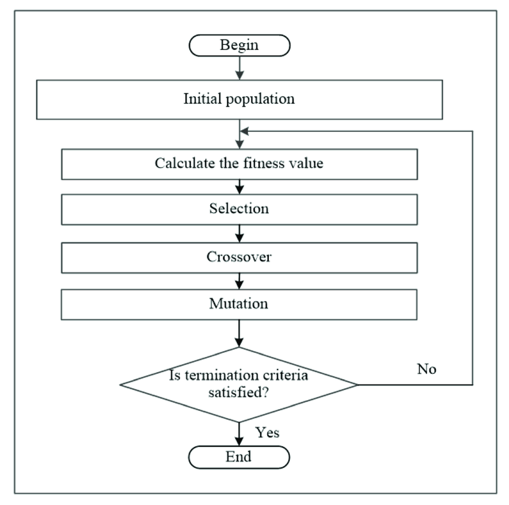

# Genetic algorithm

Genetic algorithms use principles and terminology borrowed from the biological science of genetics. In a genetic algorithm, each individual represents a potential solution to some problem. In a classical genetic algorithm, an individual is encoded by a string of binary characters - a chromosome, each bit of which is called a gene. A set of individuals – potential solutions – makes up a population. The search for a (sub)optimal solution to a problem is carried out in the process of population evolution - the sequential transformation of one finite set of solutions into another using the genetic operators: 

* Reproduction
* Crossing over
* Mutation

## Algorithm

  

## Task

Find the extremum of the Largenmann function:  
  
Solution:  

```txt
%----------------------------------------------------------------
population_size = 100; % Population size
p_crossover = 0.5; % Crossover probability
p_mutation = 0.2; % Probability of mutation
num_gen = 100; % Number of generations
x_min = 0; % Minimum x value
x_max = 10; % Maximum x value
num_repeat_to_stop = 20; % Number of repetitions until the algorithm stops
%----------------------------------------------------------------
```

Running:  
  
Result:  
  
Langerman function graph:  
  
Output:  

```txt
ga x1 = 2.0000488
ga x2 = 0.99512
ga min fitness = -5.161306
x1 = 2.002967
x2 = 1.006096
f_min = -5.162126
```
